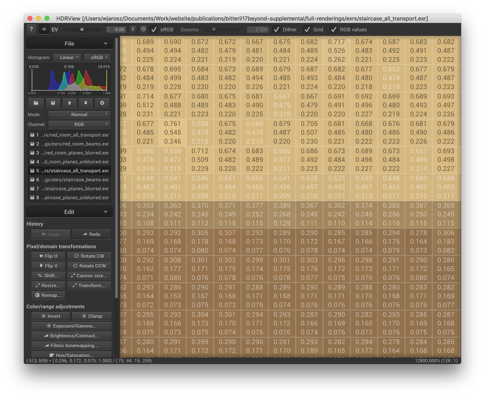

# HDRView

HDRView a simple research-oriented high-dynamic range image viewer with an emphasis on examining and comparing images, and including minimalistic tonemapping capabilities. HDRView currently supports reading EXR, PNG, TGA, BMP, HDR, JPG, GIF, PNM, PFM, and PSD images and writing EXR, HDR, PNG, TGA, PPM, PFM, and BMP images.

## Example screenshots
HDRView supports loading several images and provides exposure and gamma/sRGB tone mapping control with high-quality dithering of HDR images.

When sufficiently zoomed in, HDRView can overlay the pixel grid and numeric color values on each pixel to facilitate inspection.

## Compiling

Compiling from scratch requires CMake and a recent version of XCode on Mac, Visual Studio 2015 on Windows, and GCC on Linux.

On Linux and MacOS, compiling should be as simple as

    git clone --recursive https://bitbucket.org/wkjarosz/hdrview.git
    cd hdrview
    mkdir build
    cd build
    cmake-gui ../
    make -j 4

On Windows, open the generated file ``HDRView.sln`` after step 5 and proceed building as usual from within Visual Studio.

## Usage

Run ``./hdrview --help`` to see command-line usage, or run ``./hdrview `` and hit the ``h`` button to see a list of keyboard shortcuts in the application.

## License

Copyright (c) Wojciech Jarosz

3-clause BSD. For details, see the ``LICENSE.txt`` file.

hdrview uses Wenzel Jakob's [NanoGUI](https://github.com/wjakob/nanogui) library, which is licensed under a BSD-style license.

hdrview uses ILM's [OpenEXR](http://www.openexr.com) library, which is licensed under a modified BSD license.

hdrview uses some [stb](https://github.com/nothings/stb) libraries, developed by Sean Barrett and released under public domain.
